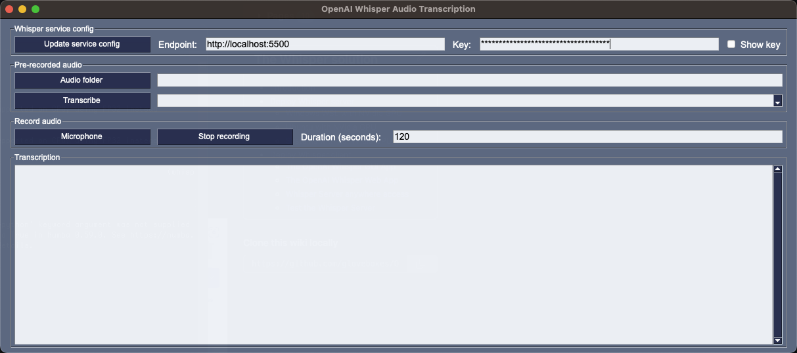

# The Whisper GUI app

Using Whisper GUI app, you can transcribe pre-recorded audio files and audio recorded from your microphone.



## Install system dependencies

Follow the instructions for your operating system.

### Install Windows 11 dependencies


### Install macOS dependencies


### Install Ubuntu dependencies


## Install the required Python libraries

1. Install the [git client](https://git-scm.com/downloads) if it's not already installed.
1. From a `Terminal` window, clone the Whisper Transcriber Sample to your preferred repo folder.
    ```bash
    git clone https://github.com/gloveboxes/OpenAI-Whisper-Transcriber-Sample.git
    ```
2. Navigate to the `client` folder.
   ```bash
   cd OpenAI-Whisper-Transcriber-Sample/client
   ```
3. Install the required libraries.

   On windows:

   ```powershell
   pip install -r requirements.txt
   ```

   On macOS and Linux:

   ```bash
   pip3 install -r requirements.txt
   ```

## Start the Whisper app

To start the Whisper GUI app, run the following command from the `client` folder.

On Windows:

```powershell
python whisper_gui.py
```

On macOS and Linux:

```bash
python3 whisper_gui.py
```

## Using the Whisper GUI app

